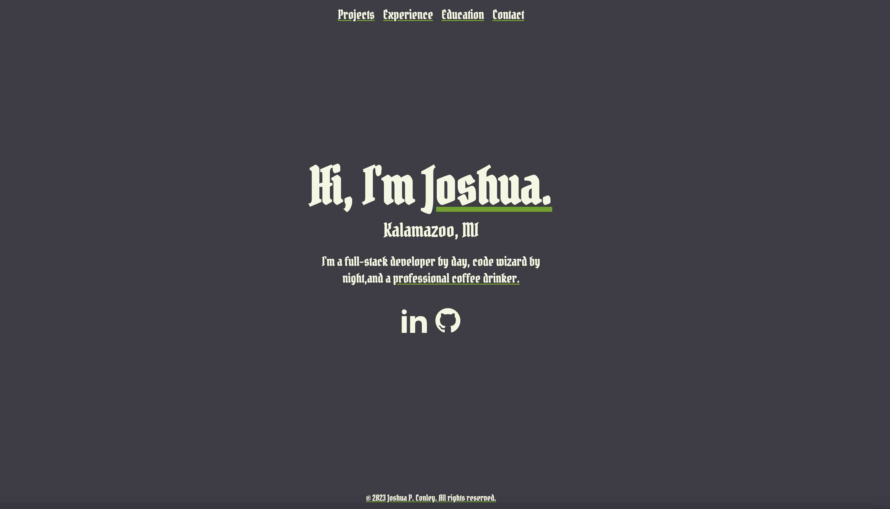

# Joshua P. Conley - Portfolio

This portfolio is a showcase of my work, crafted with Astro, and styled using Tailwind CSS with custom CSS enhancements. Typography is set using Google Fonts, and form interactions are powered by Svelte. Deployment and continuous integration are handled through Netlify.



Check out the live site here: [joshuapconley.netlify.app](https://joshuapconley.netlify.app/)

## Quick Start

Clone the repository and install the dependencies:

```bash
git clone https://github.com/jpcc0/conley-marketing.git
cd conley-marketing
npm install
```

To start the development server, run:
```bash
npm run dev
```
# 📂 Project Structure
Here's the layout of the project:

```bash
/
├── public/
│   └── assets/       # Static assets like images and fonts
├── src/
│   ├── components/   # Svelte components
│   ├── styles/       # Custom styles and Tailwind CSS
│   ├── pages/        # Astro pages (.astro files)
│   └── utils/        # Utility and helper functions
├── postcss.config.js # PostCSS configuration
├── tailwind.config.js# Tailwind CSS configuration
├── astro.config.mjs  # Astro configuration
└── package.json      # Package manifest
```
🚀 Deployment
This site is deployed on Netlify, with automatic deploys from the main branch:

```bash
npm run build  # Build the production site
npm run preview # Preview the built site locally
```
The netlify.toml file contains the necessary configurations for deployment.

# 🧰 Technologies
Astro: For building fast, modern websites.
Tailwind CSS: For utility-first styling.
Custom CSS: Additional styles for personal flair.
Google Fonts: For beautiful, readable typefaces.
Svelte: Reactive component framework for building efficient interfaces.
Netlify: Hosting and automated deployments.

# 🔗 Links & Resources
Astro Documentation
Tailwind CSS Documentation
Google Fonts
Svelte Documentation
Netlify Documentation
```bash
Feel free to fork, star, or contribute to this repository if you find it useful. Happy coding!
```
